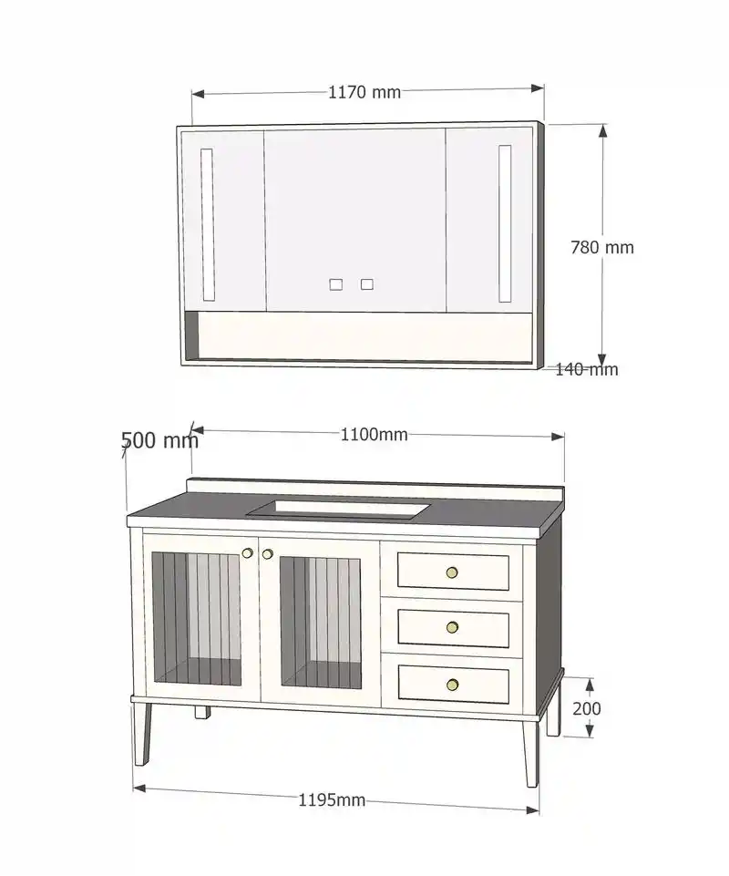

# 客户参照图



**这是客户真正要的输出。** 三视图只是过渡形态。

原始文件是微信下载的 WebP（800×961），已转成 PNG 存进仓库。
图片本身是客户自己的 SketchUp 模型导出，可以放心提交。

---

## 一、图里有两个独立视图

### 上：镜柜正立面（带尺寸标注）

| 标注 | 数值 |
|---|---|
| 宽 | **1170 mm** |
| 高 | **780 mm** |
| 深 | **140 mm** |

结构：
- **三门布局**。中门明显比两侧宽，两侧是窄门。大致比例中:左:右 ≈ 2:1:1
- 两侧窄门各有一条**竖向内嵌拉手槽**（细长矩形，凹进面板，靠近外侧边缘）
- 中门靠下方有**两个小方形拉手**，左右对称，间距很小
- 中门与侧门之间是**通高竖缝**
- 门板下方有一条**横梁**（比门略深）
- 整体白框，柜体浅灰

### 下：柜体 3D 轴测图（可旋转）

| 标注 | 数值 | 说明 |
|---|---|---|
| 台面深 | **500 mm** | 左侧标注 |
| 柜体宽 | **1100 mm** | 台面正面宽度 |
| 腿高 | **200 mm** | 右侧标注 |
| **总宽** | **1195 mm** | 底部标注 |

**注意总宽 1195 > 柜体 1100，多出 95mm。** 这说明腿是向外撇的（splayed legs），
每侧大约外撇 47.5mm。这是本图最关键的几何特征。

结构（从左到右）：
- **台面**：深灰近黑（岩板），有可见厚度，前沿能看到板厚断面
- **挡水条**：台面后方，浅色，比台面窄一点
- **台上盆**：白色矩形，有明显厚度，坐在台面上，偏左位置
- **柜体左半**：**两扇竖纹玻璃门**，每扇有约 5-6 条竖向分割线，能透视看到内部层板
- **柜体右半**：**三个抽屉**，等高。每个抽屉面板有**内嵌矩形线框**（inset panel），
  框线离面板边缘约等距
- **抽屉拉手**：圆形小钮，颜色偏金/浅黄
- 玻璃门与抽屉交界处有两个小圆圈（可能是合页或示意标记）
- **柜体底部**：一条横梁贯穿
- **四条腿**：细长**锥形**，向外撇，浅色，与柜体同色系

---

## 二、和我现有实现的差距

### 缺 3D 渲染层（最主要的差距）

我只有三个正交投影面（正/俯/剖），这张图的主体是**可轨道旋转的三维视图**。

**好消息：数据模型本来就是 3D 的。** `Part` 结构已含六个值：

```js
{ kind: 'top', x: -10, y: 770, z: 0, w: 1200, h: 20, d: 510 }
```

引入 Three.js（MIT，SaaS 友好）渲染，**数据层几乎不用改**。
Three.js 内置 OrbitControls，天然支持左右上下旋转。

坐标系映射：spec 是 `x 向右 / y 向上 / z 向房间内侧`，
Three.js 是 y 轴向上的右手系，需要把 spec 的 y 映射到 Three 的 y、z 映射到 Three 的 z，
x 保持。**注意 Three.js 相机默认看向 -z，可能需要翻转。**

### 缺模型表达力（要改引擎，比渲染层麻烦）

| 参照图里的 | 我现在 | 怎么补 |
|---|---|---|
| **锥形斜腿**，向外撇，总宽 1195 > 柜体 1100 | 只有「踢脚」（toe kick）和「悬空」（wall mount）两种 | 新增第三种支撑类型。腿是**锥形**（上粗下细），且**位置外撇**。建议 `mount: "legs"` + `legs: { height, taper, splay }` |
| **两扇竖纹玻璃门**，可见内部 | cells 只有 `drawer`/`door`/`open`/`basin` | 新增 `glass` 格类型。需要**透明材质 + 竖纹分割线** + 内部层板可见 |
| **抽屉面内嵌矩形线框** | 纯色矩形，无装饰 | 面板改成可带内嵌线框（inset panel）。线框离边等距，视觉上是凹进去的浅框 |
| **镜柜三门 + 柜内层板** | 镜柜是空盒子，无门缝无分格 | 镜柜要能像柜体一样分区（`bands`），并画门缝 |
| **竖向内嵌拉手槽** | `bar-h`/`bar-v`/`gola`/`knob` 四种 | `gola`（暗拉手）方向和形状对不上。镜柜侧门那个是**细长竖槽**，需要新样式 |
| 材质：深色岩板台面、米白柜体、金色圆钮 | 纯色白模，无材质 | 见下方「材质范围」 |
| 地面与投影 | 无环境概念 | 需要一个地面平面 + 阴影。SketchUp 那种柔和投影 |

### 缺带箭头的尺寸标注线（最快能补）

图上 1170 / 780 / 140 / 500 / 1100 / 200 / 1195 都有**箭头 + 延伸线 + 数字**。
我目前只有纯文字标注（方案名/台面/盆/主柜/分区/缝宽）。

`view.dims` 字段已预留。实现只加投影层，不动引擎。

标注样式（照着图抄）：
- 细实线延伸线，带小箭头
- 数字横向放置，不旋转（垂直方向的尺寸数字也是横排）
- 数字与线条之间留空隙，不重叠

---

## 三、材质做到什么程度（待客户确认）

**倾向先纯色白模**，理由：

- 岩板花纹**每家品牌都不同**，做成通用贴图反而失真
- 纯色 3D 客户能看清结构
- 更接近客户原本习惯的 SketchUp 出图方式
- 后续要加材质，只改材质参数，模型不动

如果要上材质，注意**字体授权**：现在是系统字体 `Microsoft YaHei`（不能打包分发）。
将来若 PNG 导出挪到服务端（Linux 无头浏览器），需要自带
**思源黑体 / Source Han Sans（SIL OFL 1.1）**，允许商用和嵌入。

---

## 四、执行顺序建议

1. **先做渲染层**（Three.js + OrbitControls + 材质 + 光照，约 400-600 行新代码）。
   有了 3D 旋转立刻能看到东西。
2. **再补模型细节**（斜腿、玻璃门、内嵌面板、镜柜分格），每补一个都能马上在 3D 里看到效果。
3. 反过来先补模型细节的话，平面图上看不出来，等于白做。

现有正/俯/剖三视图建议**保留**，在「给工厂看结构、标尺寸」时仍然有用，
与 3D 产品图并存。

---

## 五、要客户回答的问题

1. **斜腿**和**玻璃门**在实际产品里常出现吗？还是这一单的做法比较特殊？
   （决定模型层做到什么程度）
2. 尺寸标注箭头现在就要，还是等 3D 做完一起？
3. 材质先纯色白模，还是直接上岩板纹理 + 金属质感？

完整的项目进度、关键约束、踩坑清单见 `docs/台账.md`。
